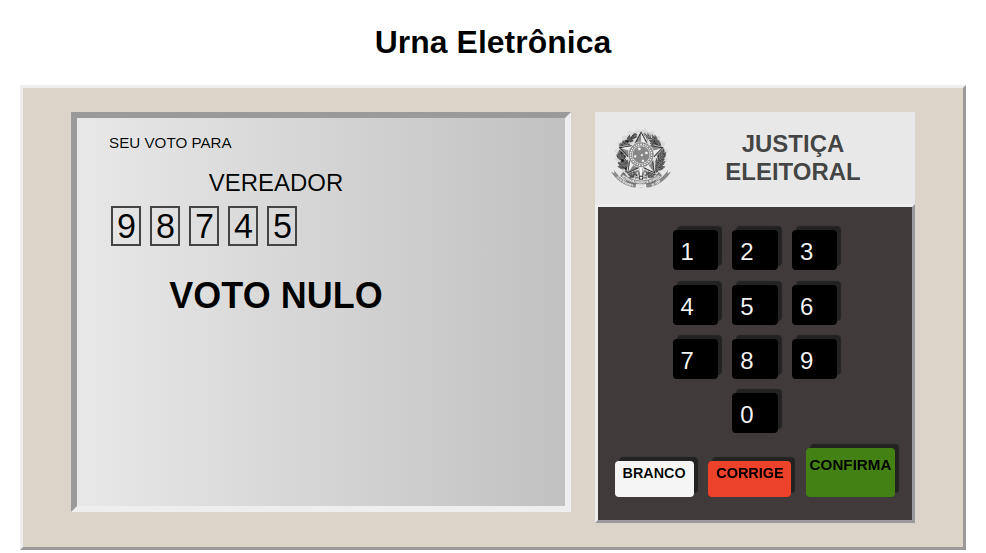
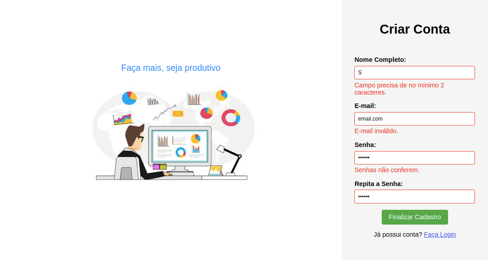

# Live em Javascript

Três projetos em Javascript puro feitos durante uma live com o professor Bonieky Lacerda da B7Web.

## Urna Eletrônica

Um simulador da urna eletrônica brasileira. O script recebe um arquivo JSON contendo as etapas da eleição, bem como os candidatos disponíveis para o pleito.

### [http://icnf.epizy.com/urna/index.html](http://icnf.epizy.com/urna/index.html)

## SlideShow

Um slider de fotos com botões para avançar, voltar e pausar a apresentação.

### [http://icnf.epizy.com/slideshow/index.html](http://icnf.epizy.com/slideshow/index.html)

## Validação de Formulário

Um formulário que, ao ser enviado, é validado pelo próprio navegador. São mostradas mensagens de erro para o usuário.

### [http://icnf.epizy.com/formulario/index.html](http://icnf.epizy.com/formulario/index.html)

